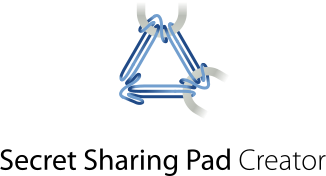

	

Secret sharing pads are a simple yet secure computer-free way to share
passwords with trusted friends and family for use in the event of an emergency.

When you encrypt your passwords, the encrypted information is split amongst
several printed pads using a technique called [secret
sharing](https://en.wikipedia.org/wiki/Secret_sharing). On their own the pads
cannot be decrypted but, when any two pads are used together, the secret
information can be decrypted using just a pen and paper.

This repository contains a simple browser-based tool for creating sets of
secret sharing pads to print out.

	

You can find an example set of secret sharing pads generated by the tool in
[`screenshots/sample_pad.pdf`](screenshots/sample_pad.pdf).

There is also a screenshot of the secret sharing pad creator user interface in
[`screenshots/creator.png`](screenshots/creator.png).

Why use secret sharing pads?
----------------------------

Secret sharing pads have several advantages over other low-technology password
sharing methods:

* Unlike sharing sealed envelopes containing your passwords:
  * Secret sharing pads do not burden the holder with the responsibility of
    storing unencrypted sensitive information.
  * Two pad holders are needed to decrypt the passwords eliminating the
    temptation for any individual to try and reveal the passwords.
  * If you stop trusting a person holding a secret sharing pad, you can render
    their pad useless by instructing the other pad holders to destroy their
    pads.

* Unlike using a solicitor to hold a copy of your passwords:
  * In the event of an emergency, the pads may be decrypted immediately without
    any delays while the request is verified.
  * Secret sharing pads are completely free to use.

Secret sharing pads also have advantages over more high-tech methods:

* Unlike password management services' emergency access schemes:
  * Secret sharing pads do not depend on a third party which can shutdown or
    terminate your account unexpectedly.
  * Decryption of a secret sharing pad requires no technical knowledge, special
    software, or in fact any computers at all. Each pad includes a complete set
    of decryption instructions requiring only a pen and paper.
  * The decision of when decrypt a secret sharing pad is made by the judgement
    of the people you trust, not by an automated system.

When shouldn't you use a secret sharing pad?
--------------------------------------------

Despite their benefits, secret sharing pads are not be the right solution for
everybody:

* Secret sharing pads require you to completely trust the people you share them
  with. There are no legal or technical barriers to pairs of pad holders
  colluding and acting in bad faith.
* There is no way to know when or if your secret sharing pads have been used.
* New secret sharing pads must be created and distributed every time a password
  is added or changed. For most people, access to just a small number of
  accounts (e.g. email), will be sufficient to unlock access to other services. 
* Secret sharing pads make the assumption that several pads will not be
  stolen from your trusted pad holders in a series of coordinated robberies.
* Secret sharing pads could be legally seized from your trusted pad holders
  against your will. If this is a concern, secret sharing pads are not for you.

How does it work?
-----------------

Secret sharing pads generated by this software uses trivial 2-of-N [secret
sharing](https://en.wikipedia.org/wiki/Secret_sharing#1_%3C_t_%3C_n,_and,_more_general,_any_desired_subset_of_n).
This scheme essentially uses a [one-time
pad](https://en.wikipedia.org/wiki/One-time_pad) for every pairwise combination
of pads to encrypt the secrets and so is uncrackable, if slightly space
inefficient.

For every secret and every pairing of pads, the following encryption procedure
is followed:

1. For a secret L characters long, L random numbers in the range 0-999 are
   chosen and printed on one pad.
2. For each character, c, in the secret and random number, r, in the random
   sequence another number is generated as `mod(1000 + ascii(c) - r, 1000)`.
   This sequence of numbers is printed on the second pad.

The length of the secret may be optionally obscured by first adding a random
number of null padding bytes to the end.

Decryption proceeds by taking matching pairs of characters from each pad,
summing them modulo 1000, and then decoding the ASCII character value.

This scheme has a few useful properties:

* The encrypted secrets can be displayed as a series of 3-digit decimal
  numbers.
* The modulo operation, in decimal arithmetic, is simply a case of discarding
  all but the last three digits.
* The restriction to ASCII characters makes providing a number-to-character
  lookup table trivial (sorry, non English-password-using folks).

Why use this software?
----------------------

The encryption procedure is sufficiently simple that it can be performed using
just a spreadsheet or even dice, pen and paper. In fact, only a tiny part of
the software in this repository is related to the encryption process
([`src/encrypt.js`](./src/encrypt.js)).

Aside from convenience, the major selling point of using this software to
create secret sharing pads (vs rolling your own with a spreadsheet) is the care
that has gone into the design of the printed pads. In particular, the
instructions provided on each pad have been refined so that they are both clear
and precise enough for a non-technical person to follow them unambiguously. You
can try these out on the example secret sharing pads in
[`screenshots/sample_pad.pdf`](screenshots/sample_pad.pdf).

Build
-----

This software (and its dependencies) can be built using NPM as follows:

    $ npm install
    $ npm run test
    $ npm run build

The resulting assets will be written to the `dist/` directory and may be used
directly from your file system (ensuring it cannot exfiltrate your secrets) or
hosted on the web.

Disclaimer & License
--------------------

This software was not built or devised by a person with specialist experience.
It is also a bit scruffy internally. Use it at your own risk!

The software is provided under the [MIT license](LICENSE.txt).

