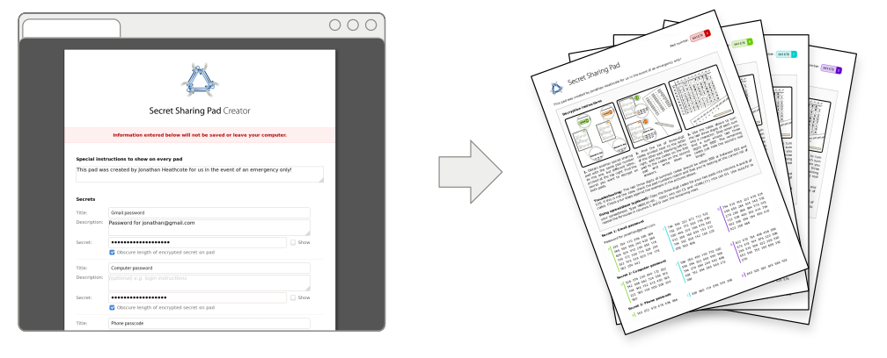

	

Secret sharing pads are a simple, computer-free way to securely share passwords
with trusted friends and family for use in emergencies.

When you encrypt your passwords using secret sharing pads, the encrypted
password is split amongst several printed pads using a technique called [secret
sharing](https://en.wikipedia.org/wiki/Secret_sharing). On their own the pads
cannot be decrypted but, when any two pads are used together, the secret
information can be decrypted using just a pen and paper.

This repository contains a simple browser-based tool for creating sets of
secret sharing pads to print out.

	

* [Try the secret sharing pad crator
  online](http://jhnet.co.uk/projects/secret_sharing_pads/app/index.html)

* [Sample Secret Sharing Pad](screenshots/sample_pad.pdf).

* [Screenshot of Secret Sharing Pad Creator](screenshots/creator.png).

* [Visit the Secret Sharing Pads website](http://jhnet.co.uk/projects/secret_sharing_pads)

Build
-----

This software (and its dependencies) can be built using NPM as follows:

    $ npm install
    $ npm run test
    $ npm run build

The resulting assets will be written to the `dist/` directory and may be used
directly from your file system (ensuring it cannot exfiltrate your secrets) or
hosted on the web.

Disclaimer & License
--------------------

This software was not built or devised by a person with specialist experience.
It is also a bit scruffy internally. Use it at your own risk!

The software is provided under the [MIT license](LICENSE.txt).

